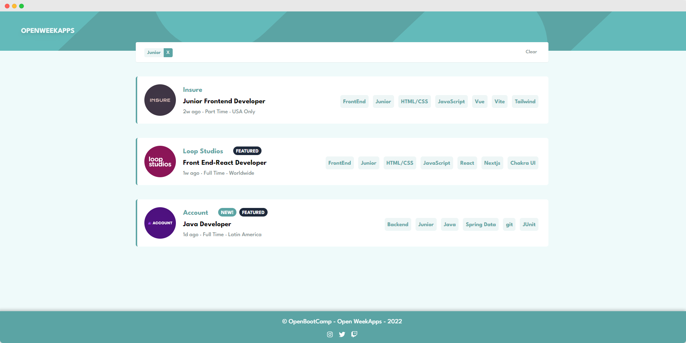

# PORTAL DE EMPLEO

## Tabla de Contenidos

- [PORTAL DE EMPLEO](#portal-de-empleo)
  - [Tabla de Contenidos](#tabla-de-contenidos)
  - [Preview](#preview)
    - [Screenshot](#screenshot)
  - [Proyecto](#proyecto)
    - [Links](#links)
  - [Proceso](#proceso)
    - [Construido con:](#construido-con)
    - [Recursos Utilizados](#recursos-utilizados)
  - [Autores](#autores)
    - [OpenBootcamp Community](#openbootcamp-community)

## Preview

### Screenshot

## Proyecto

Este proyecto fue realizado con la participación de los integrantes de OpenBootcamp, y es parte de una dinámica llamada "OpenWeekapps"

### Links

- API: [API](https://portal-de-empleo-api-production.up.railway.app/)
- Repositorio: [Solution](https://github.com/Open-Bootcamp/portal-de-empleo)
- Live Site URL: [Live App](https://job-offers-portal.vercel.app/)

## Proceso

### Construido con:

- Mobile-first
- Diseño Responsivo
- Flex y Grid Layout
- React
- React Router
- Tailwind
- Auto-animate

### Recursos Utilizados

- [React Docs](https://beta.reactjs.org/)
- [React Router Docs](https://reactrouter.com/en/v6.3.0/getting-started/overview)
- [Tailwind Docs](https://tailwindcss.com/docs/)
- [MDN Web Docs](https://developer.mozilla.org/es/docs/Web)
- [Auto-Animate](https://auto-animate.formkit.com/)

## Autores

### OpenBootcamp Community

- GitHub - [@fabioalcocer](https://github.com/fabioalcocer)
- GitHub - [@aixmarina](https://github.com/aixmarina)
- GitHub - [@Carolinuz](https://github.com/Carolinuz)
